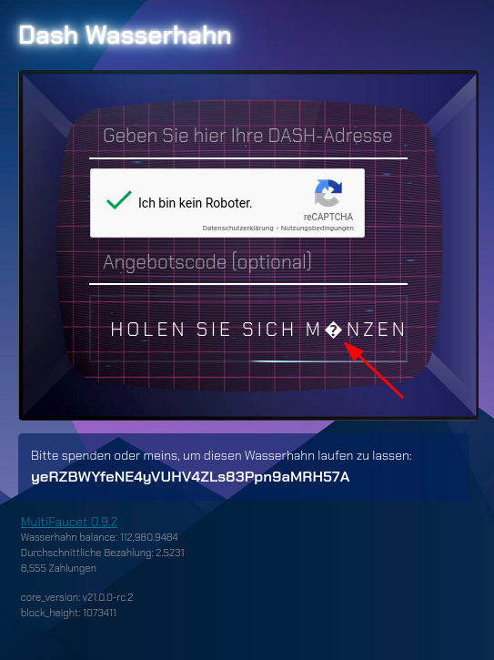
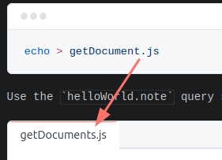

## Folder-Structure

- /dash -> First Look at Dash (Stopped at "retrieveName" Step)
- /dashmate -> First Look at Dashmate

## Feedbacks

### First Look at Dash

URL: https://ajcwebdev.com/first-look-dash/

I wrote these feedbacks down while going through the tutorial and cleaned them up a bit afterwards:

1. The tutorial starts with the heading `Dash Platform Overview` following with a historical explanation about `Dash`. I think it would make sense to split this up, e.g. by moving the about `Dash` to a little section before the `Dash Platform Overview`. This would make sure that `Dash` and `Dash Platform` are not perceived as the same thing.
2. The image of the architectural overview of Dash Platform is very small. Reducing the outer padding surrounding the diagram, could make it a bit more readable.
3. The `Setup and Configure Node Project` chapter starts without any connection to the previous one. When you come to this chapter the first thought is like: "Oh we are starting with the tutorial right now". I recommend to add (more) sentences connecting the different chapters together. Otherwise the tutorial feels like an instruction for a machine.
4. `The network will be set to testnet via the NETWORK environment variable in .env.`: A link to a list & description of the available networks would be useful here.
5. `Because we haven’t created a wallet yet`
6. The http://faucet.testnet.networks.dash.org/ generator and related links respond with blank pages after sending test funds - I recommend to atleast show a "Success" label or something.
- skipSynchronizationBeforeHeight not explained
- `LABEL` (`retrieveName`) needs to follow some very specific rules. Failing these rules does not result in errors -> ergo you don't know that you failed the rules. Advice: add error handling for the `LABEL` rules.
- Not getting enough credits for `topUp` and having to wait for one hour.
- `View on block explorer: https://platform-explorer.com/xyz` wrong url - should be `https://testnet.platform-explorer.com/xyz`
- Had to update the dash sdk version.
- General advice: add sentences like `To learn more about "xyz" go to "Article XYZ"` to the text, to lead readers to useful resources.
- Why is there no cli for some of these scripts? (Or is there one and the tutorial doesn't mention it?)
- dashUniqueIdentityId -> https://github.com/dashpay/platform/issues/1999#issuecomment-2254980339
- Problem with Umlaute in the funds-generator:
http://faucet.testnet.networks.dash.org/

### First Look at Dashmate

URL: https://ajcwebdev.com/first-look-dashmate/

Just my plain notes from the walkhrough:

- `pnpm install -g dashmate` failed with error "Command failed"
- podman docker didn't work, Fedora is still on docker-compose v1, dashmate requires v2
- "Setup JavaScript Project" -> Add a joiner-text e.g. "Lets now take a look how you can interactive with "
- "Mint Local tDash with Wallet Command" source the .env file -> `bash -c 'source .env && dashmate wallet mint --config local_seed --address=$WALLET_ADDRESS 50'`
- "Submit and Query Documents" submitDocument.js not explained enough. E.g. why does it have the `await client.platform.identities.topUp(IDENTITY_ID, 100000000)` line?
- `.create` vs `broadcast`
- `client.disconnect()` what happens if it is forgot? Doesn't the client disconnect automatically on process exit?
- `getDocuments` and `geDocument` is mixed up
